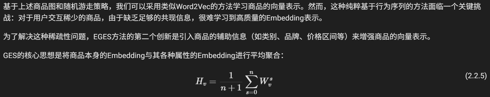
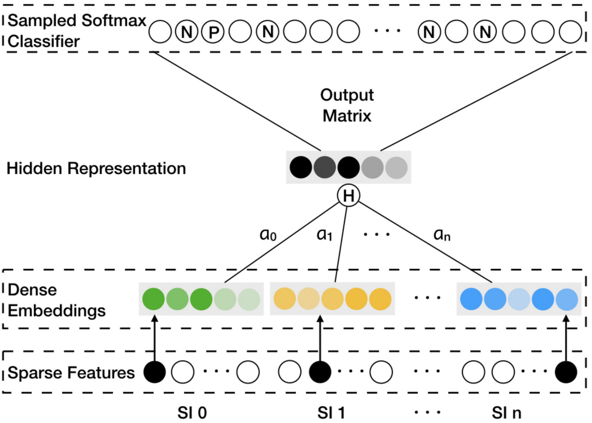
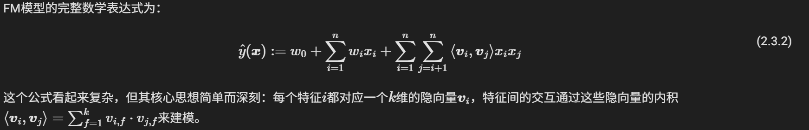
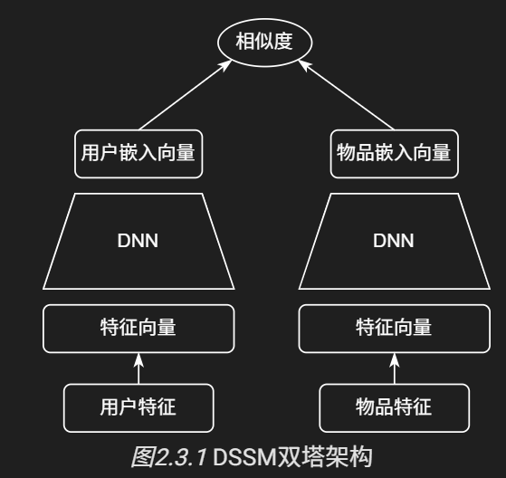
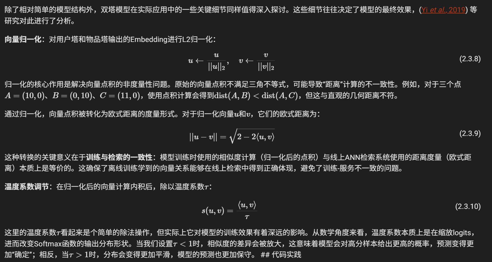

# 召回
学习项目
git 使用  
git init  
git add xxx  
git commit -m "xxx"  
git push master branch  
第三个项目（细化这个）


## 一、协同过滤
### ItemCF
基于物品的协同过滤  
1.建立物品和物品之间相似度矩阵, 使用余弦相似度计算公式  
2.受物品噪声影响大  

### Swing
建立用户-物品的二部图  
1.如果多个用户在其他共同购买行为较少的情况下, 同时购买了同一对物品, 那么这对物品之间的关联性就更可信

### UserCF
基于用户的协同过滤  
1.建立用户和用户之间的相似度矩阵, 使用余弦相似度计算公式
2.没有涉及隐空间向量的表征

### 矩阵分解 SVD
但这种方法有一个根本性的弱点：当评分数据非常稀疏时，很难找到足够的共同评分来计算可靠的相似度。矩阵分解的核心想法建立在以下两个关键假设上。<br>
1.第一个是低秩假设：虽然评分矩阵看起来很复杂，但实际上可能只受少数几个隐含因素影响，比如"面向男性vs面向女性"、"严肃vs逃避现实"等维度。<br>
2.第二个是隐向量假设：每个用户和每部电影都能用一个包含这些**隐含因子的向量**来表示，用户向量反映了其对各种因子的偏好程度，而电影向量则描述了该电影在各个因子上的特征强度。<br>
这种做法的好处是显而易见的：即使两个用户没有看过相同的电影，只要他们在隐含因子上表现相似，我们就能为他们推荐相似的内容。这大大提高了模型处理稀疏数据的能力<br>

## 二、I2I召回
#### embedding表征
##### 1.表征质量不高怎么做？  
基于上述商品图和随机游走策略，我们可以采用类似Word2Vec的方法学习商品的向量表示。  
然而，这种纯粹基于行为序列的方法面临一个关键挑战：对于用户交互稀少的商品，由于缺乏足够的共现信息，很难学习到高质量的Embedding表示。  
后面你用Qwen的4B模型，需要对商品的表征做评估：  
（1）使用召回率指标来衡量embedding质量的高低  
（2）如果只有标题信息，是否考虑辅助信息的加入  
    为了解决这种稀疏性问题，EGES方法的第二个创新是引入商品的辅助信息（如类别、品牌、价格区间等）来增强商品的向量表示。  
    所以说在回答这个问题时候可以按照它的解决思路，然后再去对比召回率，或者使用对比向量库检索的效率  
    但是这里有个坑，你如何知道两个物品之间是相似的呢？所以有基于I2I召回做相似度计算，然后看embedding后能否达到I2I召回的结果，或者说人工选择同类别的物品在一个类别里面做判断  
    
    
（3）可视化的判断，映射高维向量到低维空间，使用t-SNE算法进行可视化分析  
（4）下游任务联合评测，这个是做模型迭代工作，观测不同模型表征后所具有的指标效果情况  
##### 2.引入辅助信息的embedding
（1）加权平均：简单粗暴但是忽略各部分的权重  
（2）使用可学习的矩阵权重，可以通过指数运算归一化权重之后来确定每路的权重大小  

## 三、双塔模型
### FM（因子分解机）
核心思想是：每个特征都有其对应的dim维度的隐向量, 特征间的交互通过这些隐向量的内积表征


### DSSM（深度模型非线性）
结构图如下：  

细节部分：  


# 排序
## Wide&Deep
解决两部分, 记忆和泛化  
记忆是宽度, 泛化是深度
```
Wide: y = wx + b  
Deep: DNN
```
Wide部分的本质：为每个特征组合分配一个独立的权重，通过查表操作直接“记住”历史数据中的共现模式。  
Deep部分：需要为每个向量创建稠密向量
## DeepFM
二阶交互  
共享Embedding  
## DCN
元素级别的高阶交互  
## xDeepFM
向量级别的高阶交互  
## AutoInt
1.使用自注意力机制建模特征交互  
2.允许模型在不同的子空间中并行地学习不同方面的特征交互
3.模型将所有头的输出拼接起来，形成一个更丰富的特征表示
## 序列建模
用户的行为序列是有时间性的, 前后之间的相关性也比较强  
将用户历史看作一堆静态特征的集合，而是将其视为一个动态的序列。我们将聚焦于如何对用户的行为序列进行建模，从这个序列中挖掘出用户动态、演化的兴趣
### DIN
